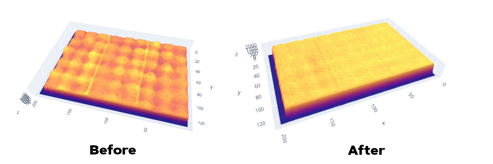

# DrLCD – Calibration of MSLA Resin Printers LCD For Even Backlight

The backlight of the masked SLA resin printers isn't perfect and it can affect
the dimensional accuracy.

This device allows you to measure the backlight and compensate for the defects:



It does so via a moving a sensor over the printer's LCD:


You can learn more in the [corresponding blog
post](https://blog.honzamrazek.cz/2022/12/about-the-successful-quest-for-perfect-msla-printer-uv-backlight/).

# Structure

The repository contains a Marlin-based firmware in the `fw` directory and
command line control app that allows you to acquire data and process them in the
`drlcd` directory.

# Usage

```
# Installation
$ pip install git+https://github.com/yaqwsx/DrLCD.git@master

# Acquire data
$ drlcd measurelcd --size <display_size_in_mm> --resolution <number_of_samples> --fast <output_file>
# E.g. drlcd measurelcd --size 202x130 --resolution 202x130 --fast frist-saturn2-mesurement.json

# Visualize measurement
$ drlcd visualize --show --title "<graph name>" <measurement file> <output HTML>

# Create compensation map
$ drlcd compensate --measurement <measurement file> --min <low value to compensate> --max <high value to compensate> --by <amount of dimming> --screen <resolution in px> --cutoff <black value for screen detection> <output PNG file>
```
